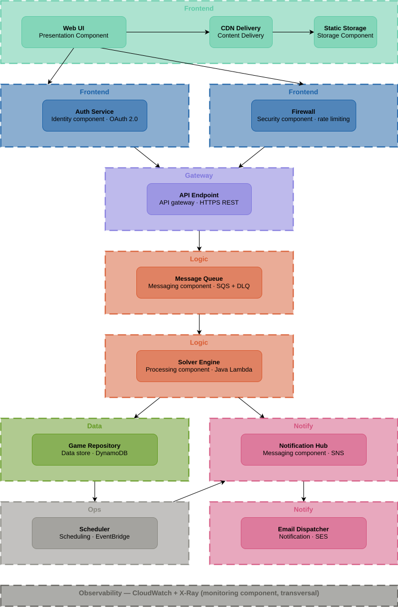

# Exact Number with AWS Cloud Services
>
> Este proyecto forma parte de la asignatura de Sistemas y Servicios en la Nube que, a su vez, es una base de mi proyecto personal [Exact Number](https://github.com/RaulJDlCRUZ/exact-number).

## Introducción

La siguiente propuesta de caso de uso tiene como principal objetivo envolver un microservicio Java en una arquitectura AWS profesional, integrando múltiples servicios para dotarlo de funcionalidades adicionales.

Para este proyecto se utilizará como base una aplicación Java desarrollada con **Spring Boot**, inspirada en las reglas básicas del programa de televisión **Cifras y Letras**, concretamente en la sección **"La cifra exacta"**.

El objetivo consiste en que, dados seis números elegidos entre:

* 1 al 9
* 25
* 50
* 75
* 100

y un número objetivo (normalmente comprendido entre 100 y 999), el sistema encuentre la secuencia de operaciones matemáticas necesaria para alcanzar dicho objetivo o, si no es posible, obtener el resultado más cercano.

### Funcionamiento

El microservicio recibe los números de entrada mediante argumentos de Maven y devuelve como salida la secuencia de operaciones encontrada.

#### Ejemplo de ejecución

```bash
mvn spring-boot:run -Dspring-boot.run.arguments="100 75 25 2 3 1 301"
```

Salida:

```text
Target Number: 301
Numbers to use: 100 75 25 2 3 1

[1] Best solution found with distance 0 and 5 operations:

100 + 75 = 175
25 + 1 = 26
175 - 26 = 149
2 * 149 = 298
3 + 298 = 301
```

> **Nota**
>
> Actualmente el microservicio es capaz de encontrar la solución exacta cuando existe. Sin embargo, no siempre determina la ruta más óptima para alcanzarla. Esta limitación se tendrá en cuenta en futuras versiones del proyecto, aunque **no forma parte de los objetivos de la presente práctica**.

## Diagrama de Arquitectura

<p align="center">
  
</p>
